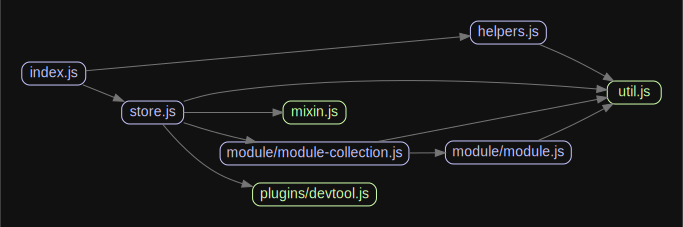

# Vuex [](https://circleci.com/gh/vuejs/vuex)


# 源码分析

## 文件结构

``` bash
├── src
|  ├── helpers.js
|  ├── index.cjs.js
|  ├── index.js - 入口文件
|  ├── mixin.js
|  ├── module
|  |  ├── module-collection.js
|  |  └── module.js
|  ├── plugins
|  |  ├── devtool.js
|  |  └── logger.js
|  ├── store.js - install方法和Store类，保证单例store
|  └── util.js
├── types
|  ├── README.md
|  ├── helpers.d.ts
|  ├── index.d.ts
|  ├── tsconfig.json
|  └── vue.d.ts
└── yarn.lock

directory: 66 file: 324

ignored: directory (2)

```

## 外部模块依赖

请在： http://npm.broofa.com?q=vuex 查看

## 内部模块依赖


  


> Centralized State Management for Vue.js.

<p align="center">
  
</p>

- [What is Vuex?](https://vuex.vuejs.org/)
- [Full Documentation](http://vuex.vuejs.org/)

## Examples

- [Counter](https://github.com/vuejs/vuex/tree/dev/examples/counter)
- [Counter with Hot Reload](https://github.com/vuejs/vuex/tree/dev/examples/counter-hot)
- [TodoMVC](https://github.com/vuejs/vuex/tree/dev/examples/todomvc)
- [Flux Chat](https://github.com/vuejs/vuex/tree/dev/examples/chat)
- [Shopping Cart](https://github.com/vuejs/vuex/tree/dev/examples/shopping-cart)

Running the examples:

``` bash
$ npm install
$ npm run dev # serve examples at localhost:8080
```

## Contribution

Please make sure to read the [Contributing Guide](https://github.com/vuejs/vuex/blob/dev/.github/contributing.md) before making a pull request.

## License

[MIT](http://opensource.org/licenses/MIT)
